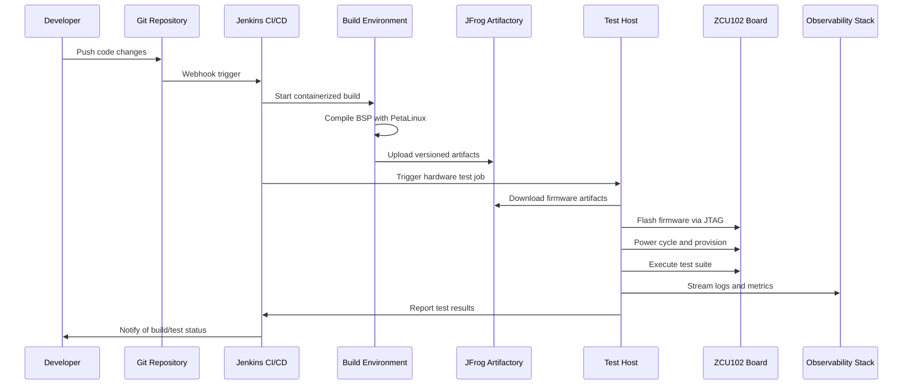

# ZCU102 BSP Validation Framework Architecture

## Executive Summary

The ZCU102 BSP Validation Framework implements a comprehensive "glass box" approach to embedded Linux validation, providing complete visibility into system behavior, performance, and reliability. This document outlines the architectural design, component interactions, and operational philosophy that enables automated, scalable, and data-driven validation of ZCU102 embedded systems.

## Architecture Overview

### System Architecture Diagram

```
                  +--------------------------+
                  |  Developer Workstation   |
                  +-------------+------------+
                                | 1. Code Push
                                v
+----------------------+   +----+-----+   +---------------------------+
| Git (Bitbucket/etc.) |<--+ Webhook  +-->|   Jenkins CI/CD Server    |
| - Test Framework Code|   +----------+   | - Orchestrates Pipeline   |
| - BSP Source Code    |                  | - Manages Build/Test Jobs |
+----------+-----------+                  +----+------------------+---+
           |                                   | 2. Pull Code       | 3. Push Artifacts
           | 5a. Pull Test Code                v                    v
           |                          +--------+-------+   +--------+---------+
           |                          | Build Executor |-->| JFrog Artifactory|
           |                          +----------------+   | - Firmware/Images|
           |                                               | - Build Artifacts|
           |                                               +--------+---------+
           |                                                        | 5b. Pull Firmware
           v                                                        v
+----------+--------------------------------------------------------+------------------+
|                                  Test Host / Lab Controller                           |
|---------------------------------------------------------------------------------------|
| - Python/Pytest Environment                                                           |
| - Hardware Control Scripts (Power, JTAG) & Test Fixtures (I2C/GPIO)                   |
| - Data Shipper (Filebeat)                                                             |
+----------+----------------------+--------------------------+-------------+-----------+
           | 6. Provision & Ctrl   | 7. Run Tests             | 8a. Push Logs| 8b. Push Metrics
           v                       v                          v             v
+----------+-----------+ +---------+----------+   +----------+-----+   +-----+------------+
| Controllable Power | |  ZCU102 Board (DUT) |   | S3 / Central |   | Prometheus/Grafana |
| + JTAG/Recovery    | | + Test Fixture     |   |   Storage    |   | + ELK Stack        |
+--------------------+ +----------------------+   +--------------+   | - Dashboards     |
                                                                     | - Analytics      |
```

## Core Components

### 1. Build and CI/CD Pipeline

**Jenkins CI/CD Server**
- **Purpose**: Orchestrates the complete build-and-test workflow
- **Key Functions**:
  - Automated BSP compilation using PetaLinux
  - Artifact versioning and storage in JFrog Artifactory
  - Test job scheduling and coordination
  - Result aggregation and notification
- **Technologies**: Jenkins, Docker, Groovy Pipeline

**Build Executor Environment**
- **Purpose**: Provides consistent, reproducible build environment
- **Key Functions**:
  - Containerized PetaLinux build environment
  - Dependency management and isolation
  - Build artifact generation and validation
- **Technologies**: Docker, PetaLinux SDK, Ubuntu

### 2. Test Host Framework

**Python Test Orchestrator**
- **Purpose**: Coordinates hardware test execution and reporting
- **Key Functions**:
  - Hardware provisioning and control
  - Test suite execution with pytest
  - Real-time metrics collection and reporting
  - Error handling and recovery procedures
- **Technologies**: Python 3.10, pytest, asyncio

**Hardware Control Subsystem**
- **Purpose**: Abstracts hardware interactions for automated testing
- **Key Components**:
  - **Power Controller**: Automated board power management
  - **JTAG Controller**: Firmware flashing and recovery
  - **Serial Interface**: Console monitoring and interaction
  - **Network Interface**: Ethernet testing and communication
- **Technologies**: pySerial, paramiko, Xilinx Vivado TCL

**Test Framework Libraries**
- **Purpose**: Provides specialized testing capabilities for each interface
- **Key Components**:
  - **Boot Validator**: Real-time boot sequence analysis
  - **UART Tester**: Serial communication validation
  - **Ethernet Tester**: Network performance and reliability testing
  - **GPIO/I2C/SPI Testers**: Hardware interface validation
- **Design Pattern**: Modular, extensible architecture with common interfaces

### 3. Observability and Analytics Stack

**Prometheus Metrics Collection**
- **Purpose**: Real-time metrics collection and alerting
- **Key Metrics**:
  - Test execution duration and success rates
  - Boot time performance and trends
  - Network throughput and latency
  - Hardware control operation metrics
  - System resource utilization
- **Technologies**: Prometheus, Pushgateway, Grafana

**ELK Stack Logging**
- **Purpose**: Centralized log aggregation and analysis
- **Key Components**:
  - **Elasticsearch**: Log storage and search engine
  - **Logstash**: Log processing and enrichment pipeline
  - **Kibana**: Visualization and dashboard platform
  - **Filebeat**: Log shipping and collection
- **Log Types**: Structured JSON logs, console output, system logs, audit trails

**Data Storage and Archival**
- **Purpose**: Long-term storage of test artifacts and historical data
- **Key Functions**:
  - Test result archival in S3-compatible storage
  - Historical trend analysis and reporting
  - Compliance and audit trail maintenance
- **Technologies**: AWS S3, MinIO, or equivalent object storage

## Data Flow and Lifecycle

### 1. Continuous Integration Workflow



### 2. Test Execution Workflow

**Pre-Test Provisioning**
1. **Hardware State Verification**: Validate board power and connectivity
2. **Firmware Deployment**: Flash latest BSP artifacts via JTAG
3. **System Initialization**: Power cycle and wait for boot completion
4. **Network Configuration**: Establish SSH connectivity for test execution

**Test Suite Execution**
1. **Boot Sequence Validation**: Monitor and analyze boot process
2. **Interface Testing**: Sequential validation of UART, Ethernet, GPIO
3. **Performance Characterization**: Throughput and latency measurements
4. **Stability Testing**: Extended operation and stress testing

**Post-Test Analysis**
1. **Results Aggregation**: Collect metrics from all test components
2. **Data Enrichment**: Add contextual metadata and environment information
3. **Storage and Archival**: Persist results for historical analysis
4. **Notification and Reporting**: Alert stakeholders of test outcomes

## Quality Assurance and Reliability

### Testing Philosophy: "Glass Box" Validation

The framework implements a "glass box" testing approach that provides complete visibility into:

- **Internal System State**: Real-time monitoring of boot stages, process states, and resource utilization
- **Performance Characteristics**: Detailed metrics on timing, throughput, and resource consumption
- **Error Conditions**: Comprehensive error detection, classification, and reporting
- **Environmental Factors**: Tracking of external conditions that may affect test results

### Reliability Engineering

**Test Repeatability**
- Containerized build environments ensure consistent compilation
- Hardware abstraction layers provide predictable test execution
- Comprehensive state management prevents test interference

**Error Handling and Recovery**
- Automated board recovery via JTAG for failed boot scenarios
- Graceful degradation when hardware components are unavailable
- Comprehensive logging of all error conditions for root cause analysis

**Performance Monitoring**
- Real-time tracking of test execution performance
- Historical trend analysis to detect performance regressions
- Alerting on test duration or success rate anomalies

## Scalability and Extensibility

### Horizontal Scaling

**Multi-Board Support**
- Abstract hardware interfaces support multiple simultaneous boards
- Load balancing of test jobs across available hardware resources
- Independent test execution prevents cross-board interference

**Distributed Test Execution**
- Test hosts can be deployed across multiple physical locations
- Centralized orchestration with distributed execution capability
- Network-based communication for result aggregation

### Vertical Extensibility

**New Test Categories**
- Modular test framework supports addition of new test types
- Plugin architecture for custom hardware interfaces
- Standardized reporting interfaces for consistent data collection

**Enhanced Observability**
- Configurable metrics collection for custom KPIs
- Extensible log parsing and enrichment pipelines
- Integration points for additional monitoring systems

## Security and Compliance

### Security Considerations

**Access Control**
- Role-based access control for Jenkins pipeline execution
- Secure credential management for hardware access
- Network segmentation between test and production environments

**Data Protection**
- Encryption of sensitive configuration data
- Secure transmission of test results and logs
- Access logging and audit trails for compliance

### Compliance Support

**Traceability**
- Full artifact versioning with commit-level traceability
- Comprehensive test result archival with retention policies
- Audit logs for all system interactions and modifications

**Documentation and Reporting**
- Automated generation of compliance reports
- Historical trending for regulatory submissions
- Integration with change management systems

## Operational Considerations

### Deployment and Maintenance

**Infrastructure as Code**
- Complete system deployment via Docker Compose
- Version-controlled configuration management
- Automated backup and disaster recovery procedures

**Monitoring and Alerting**
- Proactive monitoring of all system components
- Automated alerting for system failures or performance degradation
- Health checks and self-healing capabilities where possible

### Performance Optimization

**Resource Management**
- Efficient resource utilization through containerization
- Intelligent job scheduling based on hardware availability
- Automatic scaling based on workload demands

**Data Management**
- Intelligent data retention policies to manage storage costs
- Data compression and archival strategies
- Query optimization for historical data analysis

## Future Evolution

### Planned Enhancements

**Advanced Analytics**
- Machine learning-based anomaly detection
- Predictive failure analysis based on historical trends
- Automated root cause analysis for common failure patterns

**Enhanced Automation**
- Self-healing test infrastructure
- Intelligent test case selection based on code changes
- Automated performance regression detection and alerting

**Extended Hardware Support**
- Support for additional Xilinx development boards
- Integration with hardware-in-the-loop test systems
- Cloud-based test execution for remote development teams

### Integration Roadmap

**Development Tool Integration**
- IDE plugins for direct test execution
- Integrated debugging capabilities
- Real-time test result visualization in development environments

**Enterprise System Integration**
- Integration with enterprise CI/CD platforms
- Connection to product lifecycle management systems
- Alignment with enterprise monitoring and alerting infrastructure

---

*This architecture documentation serves as the foundation for understanding, maintaining, and extending the ZCU102 BSP Validation Framework. It embodies our commitment to engineering excellence, operational transparency, and continuous improvement in embedded systems validation.*
