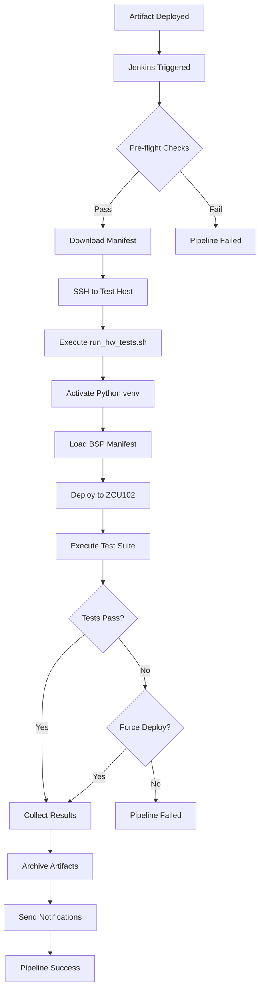

# CI/CD Pipeline Overview

## Architecture Summary

The ZCU102 BSP Hardware Validation Pipeline provides automated, end-to-end testing of Board Support Package artifacts through a Jenkins-orchestrated workflow.

```
┌─────────────────┐    ┌──────────────┐    ┌─────────────────┐    ┌─────────────────┐
│   Developer     │    │  Artifactory │    │     Jenkins     │    │   Test Host     │
│   Commits BSP   │───▶│   Webhook    │───▶│    Pipeline     │───▶│   Hardware      │
│   Changes       │    │   Trigger    │    │   Execution     │    │   Validation    │
└─────────────────┘    └──────────────┘    └─────────────────┘    └─────────────────┘
                              │                        │                     │
                              ▼                        ▼                     ▼
                       ┌──────────────┐    ┌─────────────────┐    ┌─────────────────┐
                       │  BSP Manifest│    │ Test Results &  │    │  ZCU102 Board   │
                       │  Files (.yaml)│    │ Notifications   │    │  + Peripherals  │
                       └──────────────┘    └─────────────────┘    └─────────────────┘
```

## Workflow Components

### 1. Artifact Management
- **Location**: `c:\source\Xilinx\Xilinx-MPSoC-infra\artifacts\`
- **Types**: 
  - Stable releases (`bsp-main-XXX-stable.yaml`)
  - Development builds (`bsp-dev-YYYY.MM-rcN.yaml`)
  - Security hotfixes (`bsp-hotfix-YYYY.MM.N.yaml`)
- **Content**: Complete deployment manifests with checksums, test plans, and configuration

### 2. Documentation System
- **Location**: `c:\source\Xilinx\Xilinx-MPSoC-infra\docs\artifacts\`
- **Files**:
  - `boot_binary.md` - BOOT.BIN/BOOT_DEBUG.BIN specifications
  - `kernel_image.md` - vmlinux/image.ub documentation
  - `device_tree.md` - Device tree blob information
  - `root_filesystem.md` - Root filesystem details

### 3. Jenkins Pipeline
- **File**: `c:\source\Xilinx\Xilinx-MPSoC-infra\Jenkinsfile`
- **Stages**:
  1. **Validation & Setup** - Parameter validation and environment checks
  2. **Pre-Flight Checks** - Test host connectivity and framework availability
  3. **Hardware Validation** - Execute tests via SSH on dedicated test host
  4. **Results Collection** - Gather test reports, logs, and artifacts

### 4. Test Host Controller
- **File**: `c:\source\Xilinx\Xilinx-MPSoC-infra\scripts\run_hw_tests.sh`
- **Functions**:
  - Manifest download and validation
  - Python environment activation
  - Test framework orchestration
  - Results archiving and reporting

## Trigger Mechanisms

### Artifactory Webhook Triggers
The pipeline is automatically triggered when new BSP artifacts are deployed to:
- `bsp-builds/**/*.yaml` (stable releases)
- `bsp-dev-builds/**/*.yaml` (development builds)  
- `bsp-security/**/*.yaml` (security updates)

### Manual Execution
Pipeline can be manually triggered with parameters:
- `MANIFEST_PATH`: Path to BSP manifest file
- `BUILD_ID`: Build identifier
- `TEST_SCOPE`: Test suite scope (full/smoke/regression/security)
- `FORCE_DEPLOYMENT`: Continue even if validation fails

## Test Execution Flow



## Configuration Requirements

### Jenkins Setup
1. **Required Plugins**: Pipeline, Artifactory, SSH Agent, Email Extension, Slack
2. **Credentials**: SSH keys for test host access, Artifactory integration
3. **Job Configuration**: Pipeline from SCM with webhook triggers

### Test Host Setup
1. **Framework Installation**: Python environment with dependencies
2. **Hardware Access**: USB/serial permissions for ZCU102 connectivity
3. **SSH Configuration**: Key-based authentication for Jenkins

### Artifactory Integration
1. **Webhook Configuration**: Trigger Jenkins on artifact deployment
2. **Repository Structure**: Organized by build type and version
3. **Access Control**: Service account for Jenkins integration

## Notification System

### Success Notifications
- **Slack**: Green message with build status and duration
- **Email**: Brief success notification to team distribution list

### Failure Notifications
- **Slack**: Red alert with error details and Jenkins build link
- **Email**: Detailed failure report with logs and troubleshooting information

### Notification Channels
- **Slack Channel**: `#bsp-validation`
- **Email Recipients**: `bsp-team@company.com`

## Monitoring and Observability

### Metrics Collected
- Pipeline execution duration
- Test success/failure rates
- Hardware utilization
- Artifact deployment frequency

### Log Aggregation
- **Jenkins Logs**: Build console output and pipeline stages
- **Test Host Logs**: Framework execution and hardware interaction
- **Test Results**: JUnit XML reports and screenshots

### Health Checks
- Test host connectivity monitoring
- Hardware availability verification
- Framework dependency validation

## Security Considerations

### Access Control
- SSH key-based authentication only
- Least-privilege principle for service accounts
- Regular credential rotation

### Artifact Integrity
- Checksum verification for all deployments
- Digital signatures for security updates
- Secure artifact storage in Artifactory

### Network Security
- VPN access for test host communication
- Firewall rules for Jenkins webhook endpoints
- Encrypted communication channels

## Scalability and Extensions

### Horizontal Scaling
- Multiple test hosts for parallel execution
- Load balancing across hardware pools
- Queue management for resource allocation

### Framework Extensions
- Additional board support (ZCU104, ZCU111)
- Integration with other test frameworks
- Custom test suite development

### Integration Points
- JIRA for issue tracking and test case management
- Confluence for documentation and reporting
- Grafana for metrics visualization

## Maintenance and Operations

### Regular Tasks
- Framework dependency updates
- SSH key rotation
- Log cleanup and archival
- Hardware calibration and maintenance

### Backup and Recovery
- Jenkins configuration backup (Configuration as Code)
- Test host framework backup
- Artifact repository backup and disaster recovery

### Performance Optimization
- Pipeline stage parallelization
- Artifact caching strategies
- Resource usage optimization

This comprehensive pipeline provides a robust, automated solution for ZCU102 BSP validation with enterprise-grade reliability, security, and observability.
