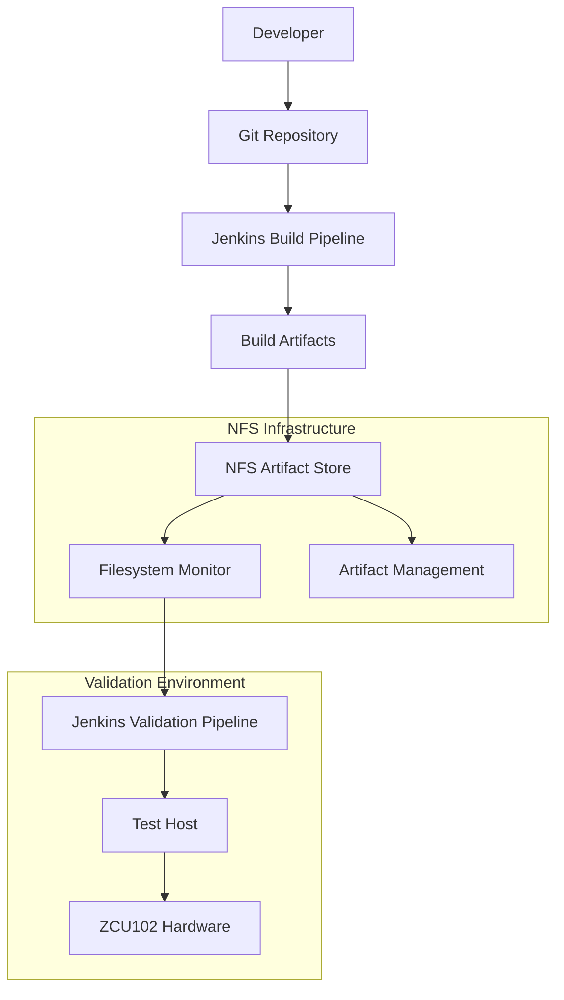
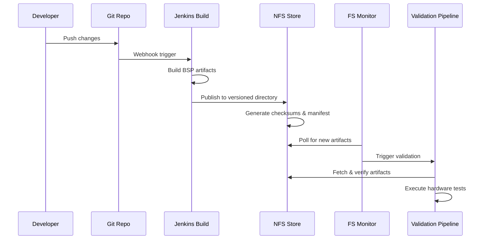
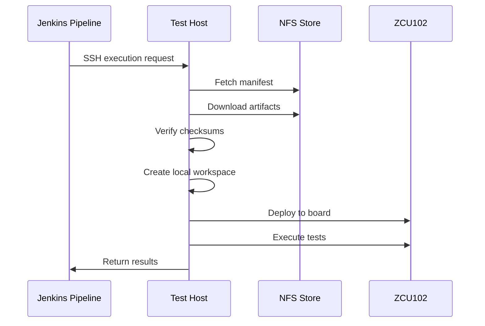

# NFS-Based BSP Validation Architecture

## System Overview

The ZCU102 BSP Hardware Validation system uses a self-hosted NFS (Network File System) infrastructure to replace managed artifact repositories like Artifactory. This approach provides filesystem-based artifact storage with automated versioning, integrity checking, and CI/CD integration.



## Component Architecture

### 1. NFS Artifact Store
**Location**: `/mnt/nfs_artifacts/bsp/`

**Structure**:
```
bsp/
├── bsp-main-137/
│   ├── BOOT.BIN + BOOT.BIN.md5
│   ├── image.ub + image.ub.md5
│   ├── system.dtb + system.dtb.md5
│   ├── rootfs.tar.gz + rootfs.tar.gz.md5
│   ├── deployment_manifest.yaml
│   └── build_metadata.json
├── bsp-dev-2025.11-rc1/
└── bsp-hotfix-2025.11.1/
```

**Responsibilities**:
- Centralized artifact storage
- Version-based directory organization
- Integrity verification through checksums
- Metadata and manifest storage

### 2. Artifact Publisher
**Script**: `scripts/publish_artifacts_to_nfs.sh`

**Workflow**:
1. Create versioned directory structure
2. Copy artifacts from build output
3. Calculate and store MD5 checksums
4. Generate deployment manifest
5. Create build metadata
6. Cleanup old artifacts (configurable retention)

**Features**:
- Atomic publishing operations
- Checksum generation and verification
- Automatic manifest generation
- Configurable retention policies

### 3. Filesystem Monitor
**Script**: `scripts/nfs_artifact_monitor.sh`

**Monitoring Strategy**:
- Polls NFS directory for new manifest files
- Tracks file modification timestamps
- Maintains state between polling cycles
- Triggers Jenkins pipeline via API

**Trigger Logic**:
```bash
# Detects new YAML manifests
find /mnt/nfs_artifacts/bsp -name "*.yaml" -newer /var/lib/monitor/last_check

# Extracts build information
python3 -c "
import yaml
with open('manifest.yaml') as f:
    data = yaml.safe_load(f)
    build_id = data['build_info']['build_id']
    build_type = data['build_info']['build_type']
"

# Triggers appropriate Jenkins job
curl -X POST "jenkins:8080/job/ZCU102-BSP-Hardware-Validation/buildWithParameters?BUILD_ID=${build_id}&TEST_SCOPE=${scope}"
```

### 4. Test Host Controller
**Script**: `scripts/run_hw_tests.sh`

**Enhanced NFS Integration**:
1. **Environment Validation**: Verify NFS mount availability
2. **Manifest Fetching**: Download from multiple NFS locations
3. **Artifact Retrieval**: Copy artifacts to local workspace
4. **Integrity Verification**: Validate checksums before use
5. **Local Workspace**: Create isolated test environment

**Error Handling**:
- NFS connectivity issues
- Checksum verification failures
- Missing artifact detection
- Fallback location resolution

### 5. Artifact Management
**Script**: `scripts/manage_nfs_artifacts.sh`

**Management Operations**:
- **List**: Display all builds with metadata
- **Info**: Detailed build information
- **Verify**: Checksum validation for builds
- **Cleanup**: Automated and manual cleanup

**Usage Examples**:
```bash
# List all artifacts with details
./manage_nfs_artifacts.sh list --details --sort date

# Verify specific build integrity
./manage_nfs_artifacts.sh verify bsp-main-137

# Clean artifacts older than 30 days
./manage_nfs_artifacts.sh cleanup --days 30 --dry-run
```

## Jenkins Pipeline Integration

### Updated Jenkinsfile Features
1. **NFS Mount Verification**: Ensures NFS availability before execution
2. **Build Path Auto-generation**: Creates NFS paths from build IDs
3. **Artifact Validation**: Verifies artifacts exist before testing
4. **Enhanced Error Handling**: NFS-specific failure modes
5. **Results Archival**: Maintains test results on NFS

### Pipeline Flow
```groovy
pipeline {
    stages {
        stage('Validation & Setup') {
            steps {
                // Verify NFS mount availability
                sh "test -d ${NFS_MOUNT_POINT} && mountpoint -q ${NFS_MOUNT_POINT}"
                
                // Auto-generate NFS build path
                script {
                    env.NFS_BUILD_PATH = "${NFS_ROOT}/${params.BUILD_ID}"
                }
            }
        }
        
        stage('Hardware Validation') {
            steps {
                sshagent(credentials: ['jenkins-test-host-key']) {
                    sh """
                    ssh testuser@test-host \
                    './scripts/run_hw_tests.sh \
                    --manifest-path="${params.MANIFEST_PATH}" \
                    --nfs-build-path="${env.NFS_BUILD_PATH}" \
                    --test-scope="${params.TEST_SCOPE}"'
                    """
                }
            }
        }
    }
}
```

## Docker Infrastructure

### NFS-Enabled Containers
All containers include NFS client support and mount points:

```dockerfile
# Install NFS client tools
RUN apt-get update && apt-get install -y nfs-common

# Create NFS mount point
RUN mkdir -p /mnt/nfs_artifacts

# Add mount helper script
COPY scripts/mount-nfs.sh /usr/local/bin/
RUN chmod +x /usr/local/bin/mount-nfs.sh
```

### Docker Compose Stack
```yaml
services:
  jenkins:
    volumes:
      - nfs_artifacts:/mnt/nfs_artifacts:ro
    
  test_host:
    volumes:
      - nfs_artifacts:/mnt/nfs_artifacts
    privileged: true  # Required for NFS mounting
    
  nfs_server:
    image: itsthenetwork/nfs-server-alpine
    environment:
      - SHARED_DIRECTORY=/nfsshare
      - PERMITTED="*(rw,sync,no_subtree_check,no_root_squash)"
```

## Data Flow Architecture

### Artifact Publishing Flow


### Artifact Consumption Flow


## Security Architecture

### NFS Security Model
```bash
# Network-level security
/etc/exports:
/exports/bsp 192.168.1.0/24(rw,sync,no_subtree_check,root_squash)

# Firewall rules
iptables -A INPUT -p tcp --dport 2049 -s 192.168.1.0/24 -j ACCEPT
```

### Integrity Verification
- **Checksum Algorithm**: MD5 (upgradeable to SHA-256)
- **Verification Points**: 
  - During artifact publishing
  - Before test execution
  - On-demand via management tools
- **Failure Handling**: Automatic rejection of corrupted artifacts

### Access Control
- **Network Segmentation**: Restrict NFS access to validation network
- **File Permissions**: Appropriate read/write permissions
- **Audit Trail**: Complete logging of artifact operations

## Monitoring and Observability

### Metrics Collection
- **Artifact Publishing**: Success/failure rates, timing
- **Download Performance**: Transfer speeds, retry counts
- **Storage Usage**: Space utilization, growth trends
- **Pipeline Triggers**: Latency, success rates

### Log Aggregation
```yaml
# Logstash configuration for NFS logs
input {
  file {
    path => "/opt/zcu102-bsp-validation/logs/*.log"
    type => "test_execution"
  }
  file {
    path => "/var/log/nfs-artifact-monitor.log"
    type => "artifact_monitor"
  }
}

filter {
  if [type] == "artifact_monitor" {
    grok {
      match => { "message" => "%{TIMESTAMP_ISO8601:timestamp} %{LOGLEVEL:level}: %{GREEDYDATA:message}" }
    }
  }
}

output {
  elasticsearch {
    hosts => ["elasticsearch:9200"]
  }
}
```

### Health Checks
- **NFS Mount Status**: Continuous monitoring
- **Artifact Integrity**: Periodic verification
- **Service Availability**: Jenkins, monitoring services
- **Network Connectivity**: NFS server reachability

## Scalability Considerations

### Horizontal Scaling
- **Multiple Test Hosts**: Parallel execution capability
- **Load Balancing**: Distribute test workloads
- **NFS Performance**: Multiple NFS servers or clustering

### Performance Optimization
```bash
# NFS mount options for performance
mount -t nfs -o rsize=32768,wsize=32768,hard,intr,timeo=600 \
    nfs-server:/exports/bsp /mnt/nfs_artifacts
```

### Storage Management
- **Automated Cleanup**: Configurable retention policies
- **Archive Strategy**: Long-term storage for compliance
- **Backup Policy**: Regular NFS data backups

## Migration Strategy

### From Artifactory to NFS
1. **Data Export**: Extract existing artifacts and metadata
2. **Bulk Import**: Use publishing scripts for migration
3. **Pipeline Updates**: Modify Jenkins configurations
4. **Validation**: Extensive testing of migrated artifacts
5. **Cutover**: Gradual transition with rollback capability

### Rollback Plan
- Maintain parallel systems during transition
- Quick switch back to Artifactory if needed
- Data synchronization between systems
- Comprehensive testing protocols

This NFS-based architecture provides a robust, self-hosted alternative to commercial artifact repositories while maintaining enterprise-grade reliability, security, and integration capabilities.
